# WebNN Non-GQA Model Architecture & Execution Flow

**Describes the modified codebase required to run non-GQA (standard attention) models via WebNN.**

**Demo code:** https://github.com/arisha07/webnn-developer-preview-genai/tree/text-generation-v2/demos/text-generation-v2

**Modified files:**
- `demos/text-generation-v2/llm.js` - inference engine (extended from `support_qwen3`)
- `demos/text-generation-v2/main.js` - model configs
- `demos/text-generation-v2/dist/` - custom ORT build (`ort.webgpu.min.js`)
- ORT WebNN EP: `Honry/onnxruntime` @ `dynamic-dim-poc` (QDQ per-axis fix, `freeDimensionOverrides`) - PR merged: https://github.com/Honry/onnxruntime/pull/21
- Chromium: `miaobin/chromium` @ `webnn-fully-dynamic-rebase` (shape folding, non-fatal validation) - PR merged: https://github.com/miaobin/chromium/pull/1

**Last updated:** June 5, 2026

---

## 1. What Is a Non-GQA Model?

Non-GQA models are ONNX exports produced by the Intel `onnx_conversion.py` script using **HuggingFace Optimum**, without the `GroupQueryAttention` fusion. Instead of ~300 fused nodes, they have ~1130–1755 fully decomposed attention nodes.

### ONNX Interface

```
Inputs:
  input_ids                     int64   [batch_size, sequence_length]
  attention_mask                int64   [batch_size, past_sequence_length + sequence_length]
  position_ids                  int64   [batch_size, sequence_length]          ← required
  past_key_values.{L}.key       float32 [batch_size, kv_heads, past_sequence_length, head_size]
  past_key_values.{L}.value     float32 [batch_size, kv_heads, past_sequence_length, head_size]

Outputs:
  logits                        float32 [batch_size, sequence_length, vocab_size]
  present.{L}.key               float32 [batch_size, kv_heads, past_sequence_length+sequence_length, head_size]
  present.{L}.value             float32 [batch_size, kv_heads, past_sequence_length+sequence_length, head_size]
```

Key differences from GQA:
- KV dtype is **float32** (not float16)
- `position_ids` is **required** (`has_position_ids: true`)
- `present` shape = `past + seq_len` per the ONNX interface, but in practice this never grows - `freeDimensionOverrides` fixes `sequence_length=1` and `past_sequence_length=maxLength-1` permanently, so `present` is always `[1, H, maxLength, D]` and `past` is always `[1, H, maxLength-1, D]`. A WebNN slice graph (`builder.slice(present, [0,0,1,0], pastDims)`) shifts the window by 1 each step, giving the same fixed-buffer effect as GQA's ScatterND
- `logits` shape is `[batch, sequence_length, vocab]` not `[batch, 1, vocab]`
- Attention uses decomposed MatMul + Softmax, no fused GQA op

### Supported Models

| Model | Config key | Layers | KV Heads | Head Size | KV Dtype | Max Length | GPU Performance |
|-------|-----------|--------|----------|-----------|----------|------------|-----------------|
| Qwen2.5 0.5B (no GQA) | `qwen25_nogqa` | 24 | 2 | 64 | float32 | 2048 | ~32 tok/s |
| Llama 3.2 1B (no GQA) | `llama1b_nogqa` | 16 | 8 | 64 | float32 | 2048 | ~25 tok/s |
| DeepSeek R1 1.5B (no GQA) | `deepseekr1_nogqa` | 28 | 2 | 128 | float32 | 4092 | ~11 tok/s |

---


## 2. Why a Custom ORT Build Is Required

### Problem: JS-Side QDQ Validation in `ort.all.min.js`

The standard `ort.all.min.js` (Content Delivery Network bundle) contains a JavaScript-side `DequantizeLinear` validation that checks:

```
assert(rank(scale) == rank(input))
```
It expects scale and input to have the same number of dimensions. But per-axis quantization uses a 1D scale for a 2D+ input - so this JS check fails and throws an error before the model even loads.


### Solution:

1. Bypass the JS check - use ort.webgpu.min.js (66KB) instead of ort.all.min.js (781KB). The webgpu bundle is a thin loader that skips the JS-side validation entirely and lets WASM handle everything.

2. Fix WASM too - inside qdq_op_builder.cc, the scale is reshaped to match the input rank before the WebNN call:

```cpp
// Removed the axis != last guard  now reshapes scale/zero_point for ALL axes
// scale [N] → reshape → [N, 1, 1] so broadcast works correctly for any input rank
```


The demo loads it from `./dist/ort.webgpu.min.js` (local), loaded in `main.js`:

```js
await loadScript("onnxruntime-web", "./dist/ort.webgpu.min.js");
```

---

## 3. Session Creation - Static Shape Strategy

### Why Non-GQA Models Require Static Shapes

Non-GQA models (HuggingFace Optimum/NNCF exports) have ~1130–1755 nodes with complex shape-computing subgraphs: `Where`/`Equal`/`Range`/`ConstantOfShape`/`Concat` chains that feed into `Reshape`/`Expand` to compute tensor shapes at runtime.

An earlier approach tried using `freeDimensionBounds` (dynamic-but-bounded shapes, the same approach GQA uses). This failed at dispatch time: Chromium's `InferAndValidateConcreteShapes` tries to re-evaluate all shape operands at dispatch using the `ShapeFoldingInterpreter` (SFI). But for non-GQA models:
- SFI was missing comparison/logical ops (`kEqual`, `kLesser`, etc.) needed to evaluate the shape chains
- Some shape operands are graph inputs from another partition - SFI can't evaluate them at all

Result: dispatch fails with "Graph has been destroyed or context is lost".

**The fix:** use `freeDimensionOverrides` (where every dim is a fixed constant, min == max). This allows ORT's standard constant folding to resolve **all** shape subgraphs at session creation time - before the WebNN API is ever called. The compiled WebNN graph has fully concrete shapes with no shape computation nodes remaining. SFI is never exercised at dispatch.

**Why GQA can use `freeDimensionBounds` (dynamic):** GQA models are exported by ORT-GenAI's `builder.py -e webgpu`, which fuses attention into a single `GroupQueryAttention` op. This export process eliminates all `Where`/`Equal`/`ConstantOfShape` nodes entirely - they don't exist in the GQA graph. With no shape computation nodes to fail on, dynamic bounds work fine.

**Note on Chromium changes:** The SFI comparison/logical op additions in `webnn-fully-dynamic-rebase` were added as defense-in-depth after discovering the dispatch failures during the dynamic approach investigation. Baseline testing confirmed they are never exercised for current non-GQA models - ORT's standard constant folding handles everything.

### `freeDimensionOverrides` for non-GQA

```js
// llm.js load() - non-GQA branch
sessionOptions.freeDimensionOverrides = {
    batch_size:                                    1,
    sequence_length:                               1,           // always one token per step
    past_sequence_length:                          maxLength - 1, // e.g. 2047
    "past_sequence_length + sequence_length":      maxLength,    // e.g. 2048
};"C:\Users\arishaku\projects\Qwen2.5_0.5B_noGQA_dump.onnx"
```

`past_sequence_length + sequence_length` is a **symbolic dim expression** that appears in non-GQA model ONNX graphs as the attention mask size. The custom ORT build parses this additive expression and resolves it to a concrete value.

Why this works:
- `sequence_length=1` → graph compiled for token-by-token mode (no batched prefill)
- `past_sequence_length=maxLength-1` → past KV shape is always `[1, H, maxLength-1, D]`
- The combined expression `= maxLength` → attention mask is always `[1, maxLength]`
- With all dims concrete, every `Where`/`Equal`/`Range`/`ConstantOfShape` shape subgraph evaluates to a constant and is folded away

### `freeDimensionBounds` - Not Used for Non-GQA

GQA uses `freeDimensionBounds` (dynamic-but-bounded) because its graph has no shape computation nodes to fail on. Non-GQA sets `freeDimensionBounds: undefined` - dynamic bounds caused dispatch failures (see "Why Non-GQA Models Require Static Shapes" above). Everything is static via `freeDimensionOverrides`.

### `enableCausalLM` - OV EP Hint Only

```js
enableCausalLM: !!options.enable_causallm,  // passed to OpenVINO EP
```

This is wired through to ORT's session options (`session-options.ts`) as an EP option:

```ts
if (enableCausalLM) {
    appendEpOption(epOptions, 'enableCausalLM', 'true', allocs);
}
```

This is an OpenVINO EP hint — it does **not** change any JS-side tensor shapes or logic.

---

## 4. `llm.js` — Step by Step

This is the full sequence from the user clicking a model button to tokens streaming on screen.

```mermaid
flowchart TB
    A["User selects model"] --> B

    subgraph LOAD["load()  —  runs once at model selection"]
        B["Fetch model.onnx + .data from OPFS/network"]
        B --> C["navigator.ml.createContext()  →  MLContext"]
        C --> D["ort.InferenceSession.create()\nONNX → WebNN ops  (ORT WASM)\n→ Mojo IPC → WebNN ops → ONNX  (graph_builder_ort.cc)\n→ native ORT session → OpenVINO  (2–10s)"]
    end

    D --> E

    subgraph INIT["initialize()  —  runs once after load"]
        E["Allocate past KV tensors  [1, H, maxLen-1, D]  zero-filled"]
        E --> F["Allocate present KV tensors  [1, H, maxLen, D]"]
        F --> G["Allocate logits tensor  [1, 1, vocabSize]  readable=true"]
        G --> H["Build WebNN slice graph\npresent[1:] → past  (GPU-to-GPU KV shift)"]
    end

    H --> I

    subgraph PREFILL["generate() — prefill  (one dispatch per prompt token)"]
        I["For each prompt token:\nfeed input_ids=[token]  attention_mask=[1,maxLen]  position_ids=[pos]"]
        I --> J["session1.run()  →  GPU dispatch"]
        J --> K["Read logits back to CPU\nUpdate KV via slice graph\nstartLength++"]
        K -->|"more prompt tokens"| I
    end

    K -->|"all prompt tokens done"| L

    subgraph DECODE["generate() — decode loop  (one dispatch per output token)"]
        L["feed input_ids=[lastToken]  update mask + position_ids"]
        L --> M["session1.run()  →  GPU dispatch"]
        M --> N["readBackMLTensor() → logitsBuffer\nselectToken() → argmax or top-k/p sampling"]
        N --> O["updateKvCache()\ndispatch slice graph  present→past  (GPU-to-GPU)"]
        O --> P["callback(outputTokens)  →  stream text to UI\nstartLength++"]
        P -->|"not EOS and not maxLength"| L
    end

    P -->|"EOS or maxLength"| Q["Generation complete"]

    classDef loadStyle stroke:#818cf8,fill:#eef2ff,color:#000
    classDef initStyle stroke:#a78bfa,fill:#f5f3ff,color:#000
    classDef prefillStyle stroke:#2dd4bf,fill:#f0fdfa,color:#000
    classDef decodeStyle stroke:#fb923c,fill:#fff7ed,color:#000

    class LOAD,A,B,C,D loadStyle
    class INIT,E,F,G,H initStyle
    class PREFILL,I,J,K prefillStyle
    class DECODE,L,M,N,O,P,Q decodeStyle
```



**Step 1 - `load(model, options)`**
Reads model config values (`numLayers`, `kvNumHeads`, `headSize`, `vocabSize`, `kvDtype`, `useGqa`, `hasPositionIds`). Fetches `model.onnx` and its `.data` file from OPFS or network. Creates `MLContext` via `navigator.ml.createContext({ deviceType })`. Builds `sessionOptions` with `executionProviders`, `freeDimensionOverrides` (non-GQA) or `freeDimensionBounds` (GQA), and `externalData`. Calls `ort.InferenceSession.create()` - this is the slow step (2–10s): ORT WASM (1) folds shape subgraphs via `ShapeSubgraphFolder`, (2) translates ONNX → WebNN ops via `model_builder.cc`, (3) sends the WebNN graph across Mojo IPC to Chromium's GPU process, where `graph_builder_ort.cc` rebuilds it back into an ONNX model, native ORT creates a session with OpenVINO EP, and OVEP compiles it to GPU kernels.

**Step 2 - `initialize()`**
Pre-allocates all GPU memory before inference starts:
- Past KV tensors (`feed["past_key_values.{i}.key/value"]`) - shape `[1, H, maxLength-1, D]`, zero-filled
- Present KV tensors (`fetches["present.{i}.key/value"]`) - shape `[1, H, maxLength, D]`
- Logits tensor (`fetches["logits"]`) - shape `[1, 1, vocabSize]`, `readable=true`
- Builds the WebNN slice graph: `present[1:] → past` (GPU-to-GPU KV shift, no CPU roundtrip)

**Step 3 - `generate(inputIds, callback)`**
Called with the tokenized prompt. Runs two phases:

*Prefill* - token by token (non-GQA has no batched prefill):
- For each prompt token: sets `feed["input_ids"]=[token]`, builds fixed-size `[1, maxLength]` attention mask with left-padded zeros, sets `feed["position_ids"]=[startLength]`
- Calls `session1.run(feed, fetches)` - one GPU dispatch per prompt token
- Reads logits back to CPU, updates KV cache via slice graph, increments `startLength`

*Decode loop* - runs until EOS token or `maxLength`:
- Sets `feed["input_ids"]=[lastToken]`, updates attention mask, increments `position_ids`
- Calls `session1.run(feed, fetches)`
- Reads logits via `readBackMLTensor()` - only ~vocab_size floats cross GPU→CPU
- Calls `selectToken()` - argmax (temperature=0) or top-k/top-p sampling
- Calls `updateKvCache()` - dispatches slice graph to shift present→past (GPU-to-GPU)
- Calls `callback(outputTokens)` - streams decoded text to UI
- Increments `startLength`

**Step 4 - `updateKvCache(outputs)`**
For GPU non-GQA: dispatches the pre-built WebNN slice graph for each layer - takes `present [1,H,maxLength,D]` and writes `present[1:] → past [1,H,maxLength-1,D]` on the GPU. No JS object reference swap needed - the slice graph writes directly into the pre-allocated past tensor.

**Step 5 - Token selection**
`selectToken()` calls either `argmax()` (greedy, temperature=0) or `sampleTopK()` (temperature>0 with optional top-k and top-p nucleus filtering) on the logits buffer read back from GPU.

---

## 5. Model Config in `main.js`

Non-GQA models require these additional fields compared to GQA configs:

```js
qwen25_nogqa: {
    name: "Qwen2.5 0.5B Instruct (no GQA)",
    id: "Qwen/Qwen2.5-0.5B-Instruct",
    file_name: "model.onnx",
    external_data_file: "8c28285e-53bd-11f1-8199-58cdc9c761b4.data",  // ← custom .data file name
    local_path: "../text-generation/models/Qwen/Qwen2.5-0.5B-Instruct/",
    remote_path: "",                           // ← local only, no remote
    eos_token_id: [151645, 151643],
    max_length: 2048,
    num_layers: 24,
    kv_num_heads: 2,
    head_size: 64,
    vocab_size: 151936,
    has_position_ids: true,                    // ← required for non-GQA
    use_gqa: false,                            // ← triggers non-GQA path in llm.js
    kv_dtype: "float32",                       // ← float32, not float16
    system_content: "You are a helpful assistant.",
},
```

Key non-GQA-specific fields:

| Field | Value | Why |
|-------|-------|-----|
| `use_gqa` | `false` | Routes to non-GQA path in `llm.js` |
| `kv_dtype` | `"float32"` | Non-GQA models export float32 KV (not float16) |
| `has_position_ids` | `true` | Non-GQA models require explicit position_ids input |
| `external_data_file` | UUID string | Model's `.data` file has a UUID name, not `model.onnx.data` |
| `remote_path` | `""` | Local-only models (not yet on HuggingFace hub) |
| `enable_causallm` | `false`/`true` | OV EP hint; no JS effect |

---

## 6. Memory Allocation - Fixed-Size KV with Different Shapes

**Why past and present have different shapes**

In GQA, the `GroupQueryAttention` op uses `ScatterND` to write the new token's K/V into the existing buffer at a specific offset. The buffer never changes size — past and present are always `[1, H, maxLength, D]`. In non-GQA there is no fused op doing that in-place write. The model simply concatenates the new token onto the end of the sequence, so `present` is always one position longer than `past`.

```
GQA:     past [1, H, maxLength, D]    ==    present [1, H, maxLength, D]   (same - ScatterND in-place)
Non-GQA: past [1, H, maxLength-1, D]  ≠    present [1, H, maxLength, D]   (present = past + 1 new token)
```

**What the writable/readable flags control**

These flags are not just metadata - they determine what operations are valid on the GPU buffer. A tensor marked `writable=true` allows JS to call `writeTensor()` on it to push data from CPU to GPU. A tensor marked `readable=true` allows `readTensor()` and also allows it to be used as an input to a WebNN `dispatch()` call. A tensor that is neither writable nor readable is the most GPU-efficient - it lives entirely on the GPU and JS can never touch it.

| Tensor | writable | readable | Reason |
|--------|----------|----------|--------|
| Past KV (`feed`) | true | false | JS must zero-fill before first step via `writeTensor()` |
| Present KV (`fetches`) | false | true | Slice graph dispatches with it as input; JS never writes to it |

In `initialize()` (`llm.js`), the non-GQA branch:

```js
const pastSeqLen    = this.maxLength - 1;   // e.g. 2047
const presentSeqLen = this.maxLength;        // e.g. 2048
const pastDims    = [1, this.kvNumHeads, pastSeqLen,    this.headSize];
const presentDims = [1, this.kvNumHeads, presentSeqLen, this.headSize];

for (let i = 0; i < this.numLayers; ++i) {
    feed[`past_key_values.${i}.key`]  = createMlTensor(ctx, kvDtype, pastDims,    writable=true,  readable=false)
    feed[`past_key_values.${i}.value`]= createMlTensor(ctx, kvDtype, pastDims,    writable=true,  readable=false)
    fetches[`present.${i}.key`]       = createMlTensor(ctx, kvDtype, presentDims, writable=false, readable=true)
    fetches[`present.${i}.value`]     = createMlTensor(ctx, kvDtype, presentDims, writable=false, readable=true)
}

// Zero-fill all past KV tensors
const kvZeros = new Float32Array(kvNumHeads * pastSeqLen * headSize);
for (let i = 0; i < numLayers; ++i) {
    await mlContext.writeTensor(feed[`past_key_values.${i}.key`].mlTensor,   kvZeros);
    await mlContext.writeTensor(feed[`past_key_values.${i}.value`].mlTensor, kvZeros);
}
```

**Why zero-fill is required**

MLTensors are raw GPU memory allocations - they do not start as zeros. On the very first decode step, the attention computation reads the entire past buffer including all the positions not yet written (positions 0 through `maxLength-2` are all unwritten at the start). If those positions contain garbage values, the attention scores will be corrupted and the model will produce nonsense output. Zero-filling ensures those unwritten positions contribute nothing to the attention scores.

---

## 7. GPU-Resident KV Cache - WebNN Slice Graph

This is the key optimization that makes non-GQA GPU throughput competitive. Without it, 134 MB of KV data must travel GPU→CPU→GPU every token step.

### The Problem

After each inference step, the model outputs:
```
present.*.key shape: [1, H, maxLength, D]   (= past + new token at end)
```

To feed this back as the next step's past, we need:
```
next past.*.key shape: [1, H, maxLength-1, D]   (drop the oldest position, shift left by 1)
```

The `slice(present, [0,0,1,0], pastDims)` operation extracts positions `[1:]` along the seq dim - but this cannot be done in-place on an MLTensor without reading it back to CPU.

### The Solution: Standalone WebNN Slice Graph

A minimal WebNN graph is built **once at initialization** that performs this slice entirely on GPU:

```js
// Built once in initialize() - llm.js
const builder = new MLGraphBuilder(this.mlContext);
const sliceInput = builder.input('present', {
    dataType: 'float32',
    shape: presentDims   // [1, H, maxLength, D]
});
const sliceOutput = builder.slice(sliceInput, [0, 0, 1, 0], pastDims);  // skip seq pos 0
this.kvSliceGraph = await builder.build({ 'past': sliceOutput });
```

Then each decode step calls `dispatch()` twice per layer - once for key, once for value. So `numLayers × 2` total dispatches (32 for a 16-layer model, 48 for 24 layers):

```js
// In updateKvCache() - llm.js, called after every session.run()
for (let i = 0; i < this.numLayers; ++i) {
    this.mlContext.dispatch(this.kvSliceGraph,
        { 'present': this.fetches[`present.${i}.key`].mlTensor },    // input: [1,H,maxLen,D]
        { 'past':    this.feed[`past_key_values.${i}.key`].mlTensor } // output: [1,H,maxLen-1,D]
    );
    this.mlContext.dispatch(this.kvSliceGraph,
        { 'present': this.fetches[`present.${i}.value`].mlTensor },
        { 'past':    this.feed[`past_key_values.${i}.value`].mlTensor }
    );
}
```

### Memory Layout - Sliding Window

```
Step N present output [1, H, maxLength, D]:
pos: [  0  |  1  |  2  | ... | N-1 |  N  ]   ← maxLength positions
      OLD    t₁     t₂         tₙ₋₁  NEW

After GPU slice [0,0,1,0:] → past [1, H, maxLength-1, D]:
pos: [  1  |  2  | ... | N-1 |  N  ]          ← shifted left, oldest dropped
      t₁     t₂         tₙ₋₁  NEW

Next step feeds this as past_key_values - window slides forward by 1.
```


---

## 8. Prefill - Token-by-Token (Forced by `sequence_length=1`)

Because `freeDimensionOverrides` sets `sequence_length=1`, the compiled graph accepts only `[1, 1]` input_ids. Prefill must process one token at a time:

```js
// In generate() - llm.js, non-GQA path
for (let i = 0; i < inputIdsLen; ++i) {
    // One token at a time
    feed["input_ids"]      = new ort.Tensor("int64", [inputIds[i]], [1, 1]);

    // Fixed-size attention mask: always [1, maxLength]
    // Left-padded zeros, ones grow right-to-left as tokens accumulate
    const numReal = this.startLength + 1;   // tokens seen so far + current
    const mask = new BigInt64Array(this.maxLength);
    for (let j = this.maxLength - numReal; j < this.maxLength; j++) mask[j] = 1n;
    feed["attention_mask"] = new ort.Tensor("int64", mask, [1, this.maxLength]);

    // position_ids: current absolute position
    feed["position_ids"]   = new ort.Tensor("int64", [BigInt(this.startLength)], [1, 1]);

    outputs = await session1.run(feed, fetches);

    // Read logits back to CPU (only logits - ~600KB)
    await readBackMLTensor(mlContext, fetches["logits"].mlTensor, logitsBuffer);

    // Update KV: dispatch slice graph (GPU-to-GPU)
    await updateKvCache(outputs);
    this.startLength++;
}
```

**Trade-off vs GQA:** GQA prefill processes all N prompt tokens in one dispatch. Non-GQA requires N dispatches. For a 24-token prompt, this is 24 inference calls during prefill, giving a higher time-to-first-token. Decode speed is comparable.

### Attention Mask Shape - Always Fixed

```
maxLength = 2048

Prefill token 0:   [0, 0, 0, ..., 0, 0, 1]   shape: [1, 2048]   (1 one, right-aligned)
Prefill token 1:   [0, 0, 0, ..., 0, 1, 1]   shape: [1, 2048]   (2 ones)
Prefill token 23:  [0, 0, ..., 0, 1, ..., 1]  shape: [1, 2048]   (24 ones)
Decode step 1:     [0, 0, ..., 1, 1, ..., 1]  shape: [1, 2048]   (25 ones)
...
```

The shape **never changes** - always `[1, maxLength]`. This is what makes the fully static compilation via `freeDimensionOverrides` possible.

---

## 9. Decode Loop

After prefill, the decode loop mirrors GQA but with the fixed-size mask and the GPU slice graph KV update:

```js
while (!eos && startLength < maxLength) {
    feed["input_ids"]      = new ort.Tensor("int64", [BigInt(lastToken)], [1, 1]);

    // Fixed-size mask - same pattern as prefill
    const numReal = this.startLength + 1;
    const mask = new BigInt64Array(this.maxLength);
    for (let j = this.maxLength - numReal; j < this.maxLength; j++) mask[j] = 1n;
    feed["attention_mask"] = new ort.Tensor("int64", mask, [1, this.maxLength]);

    feed["position_ids"]   = new ort.Tensor("int64", [BigInt(this.startLength)], [1, 1]);

    // GPU dispatch - past KV is always [1, H, maxLength-1, D]
    outputs = await session1.run(feed, fetches);

    // Only logits read back (~600KB)
    await readBackMLTensor(mlContext, fetches["logits"].mlTensor, logitsBuffer);

    lastToken = selectToken(logitsBuffer);
    outputTokens.push(lastToken);
    callback(outputTokens);

    // GPU slice: present[1:] → past (32 dispatches, GPU-to-GPU)
    await updateKvCache(outputs);
    startLength++;
}
```

---

## 10. What Stays on GPU vs What Crosses to CPU

```
GPU (MLTensor, stays on GPU):
  past_key_values.*.key    [1, H, 2047, D]   - past KV, writable by writeTensor
  past_key_values.*.value  [1, H, 2047, D]
  present.*.key            [1, H, 2048, D]   - present KV output, readable by slice graph
  present.*.value          [1, H, 2048, D]
  (all intermediate attention computations)

CPU (crosses GPU→CPU per token):
  logits                   [1, 1, vocab]      - ~600KB, for token selection
  (position_ids, input_ids, attention_mask)   - tiny int64 tensors fed in each step
```

KV data that moves GPU→CPU per step: **0 bytes**.

---


## 11. `logits` Readback - Non-GQA vs GQA

One important difference: for non-GQA models the logits tensor shape during prefill is technically `[1, sequence_length, vocab_size]`. However because `sequence_length=1` is fixed by `freeDimensionOverrides`, this is always `[1, 1, vocab_size]` - identical to GQA. The same `readBackMLTensor` path is used:

```js
// GPU path (same for GQA and non-GQA)
await readBackMLTensor(this.mlContext, this.fetches["logits"].mlTensor, this.logitsBuffer);
```

---

## 12. Non-GQA vs GQA - Side-by-Side

| Aspect | GQA (unmodified `support_qwen3`) | Non-GQA (modified `text-generation-v2`) |
|--------|----------------------------------|----------------------------------------|
| **Model generation tool** | ORT-GenAI `builder.py -e webgpu` | **HuggingFace Optimum + NNCF** (`onnx_conversion.py`) |
| **Export method** | ORT-GenAI model builder (fused) | `ORTModelForCausalLM.from_pretrained(export=True)` |
| **Compression** | ORT-GenAI built-in INT4 (`-p int4`) | **NNCF `compress_weights()`** |
| **Sanity check** | Not included | **OV inference run included in script** |
| Graph nodes | ~300 | **~1130–1755** |
| Attention | `GroupQueryAttention` (fused) | **Decomposed MatMul + Softmax** |
| `.data` file name | `model.onnx.data` | **UUID** (e.g. `04f049c9-....data`) |
| KV dtype | float16 | **float32** |
| `position_ids` | Not required | **Required** |
| `freeDimensionBounds` | `sequence_length`, `total_sequence_length` | Not set (undefined) |
| `freeDimensionOverrides` | `batch_size`, `past_sequence_length` | **`batch_size`, `sequence_length=1`, `past_sequence_length`, `past+seq`** |
| KV dims (past) | `[1, H, maxLength, D]` | **`[1, H, maxLength-1, D]`** |
| KV dims (present) | `[1, H, maxLength, D]` (same as past) | **`[1, H, maxLength, D]`** (one larger than past) |
| KV update | ScatterND (in-place, inside GQA op) | **GPU WebNN slice graph** (standalone dispatch) |
| Zero-fill required | No | **Yes** (uninit MLTensors cause corrupt attention) |
| Prefill | One dispatch (all N tokens) | **N dispatches** (one token at a time, `sequence_length=1`) |
| Attention mask shape | Growing `[1, startLength+i]` | **Fixed** `[1, maxLength]`, left-padded zeros |
| ORT bundle | `ort.all.min.js` or `ort.webgpu.min.js` | **Must use `ort.webgpu.min.js`** (QDQ per-axis fix) |
| Chromium changes needed | No | **Yes** (defense-in-depth; baseline performance identical without them) |
| GPU performance | 12–32 tok/s | **25–32 tok/s** (GPU-resident KV) |

---

## 13. Performance Profile - Non-GQA

### Measured: Llama 3.2 1B (no GQA)

| Metric | Value |
|--------|-------|
| **Decode throughput** | **25.10 tok/s** |
| TTFT | ~2 s |
|

### Measured: Qwen2.5 0.5B (no GQA), WebNN GPU

| Metric | Value |
|--------|-------|
| Decode throughput | ~32 tok/s |
| TTFT | ~1 s |

---

## 14. File Map - Changes from Baseline

| File | Change | Why |
|------|--------|-----|
| `demos/text-generation-v2/llm.js` | Added `use_gqa` branching throughout `load()`, `initialize()`, `updateKvCache()`, `generate()` | Routes non-GQA to fixed-KV path |
| `demos/text-generation-v2/llm.js` | Added GPU WebNN slice graph build in `initialize()` | GPU-resident KV update |
| `demos/text-generation-v2/llm.js` | Added `kvDtype` float32 support, `Float32Array` buffers | Non-GQA uses float32 KV |
| `demos/text-generation-v2/llm.js` | Added `has_position_ids` feed in prefill/decode loops | Non-GQA requires explicit position_ids |
| `demos/text-generation-v2/llm.js` | Fixed-size `[1, maxLength]` attention mask with left-padded zeros | Required by `freeDimensionOverrides` static shape |
| `demos/text-generation-v2/llm.js` | Token-by-token prefill loop for non-GQA | `sequence_length=1` is always fixed |
| `demos/text-generation-v2/llm.js` | Zero-fill past KV in `initialize()` | Prevent corrupt attention from uninit MLTensors |
| `demos/text-generation-v2/llm.js` | Added `enableCausalLM` EP option passthrough | OV EP hint |
| `demos/text-generation-v2/main.js` | Added `use_gqa:false`, `kv_dtype:"float32"`, `has_position_ids:true` configs | Identifies non-GQA models |
| `demos/text-generation-v2/main.js` | Added `external_data_file` per model | UUID-named .data files |
| `demos/text-generation-v2/dist/` | Custom ORT build with `ort.webgpu.min.js` | Bypasses broken JS QDQ check |
| `qdq_op_builder.cc` (ORT WebNN EP) | Removed `axis != last` guard in DQLinear | Enables per-axis quantized models |
| `webnn_context_impl.cc` (Chromium) | Non-fatal `InferAndValidateConcreteShapes` | Prevents hard failure on edge cases |
| `shape_folding_interpreter.cc` (Chromium) | Added comparison/logical/where/range ops | Defense-in-depth for future models |

---

## 15. How Non-GQA Models Are Generated

Non-GQA models are produced by a custom Intel conversion script (`onnx_conversion.py`) rather than the ORT-GenAI `builder.py` used for GQA models. The key difference is that this script exports via **HuggingFace Optimum** (preserving the decomposed attention graph) and then applies **NNCF INT4 weight compression**.

### Example Command

```bash
cd frameworks.ai.validation.genai\utilities\onnx_model_conversion

python onnx_conversion.py \
  --model_id  meta-llama/Llama-3.2-3B-Instruct \
  --output_dir Llama-3.2-3B-Instruct-nogqa \
  --ratio 1.0 \
  --mode  int4_sym
```


> **Important:** The `.data` file gets a UUID filename (e.g. `04f049c9-6047-11f1-8199-58cdc9c761b4.data`) rather than the conventional `model.onnx.data`. This is why `main.js` configs include an explicit `external_data_file` field:
> ```js
> external_data_file: "04f049c9-6047-11f1-8199-58cdc9c761b4.data",
> ```

### Key Values from `genai_config.json` → `main.js`

After conversion, read `genai_config.json` to populate the model config:

```json
// genai_config.json (Llama 3.2 3B example)
{
    "model": {
        "decoder": {
            "head_size": 128,           → head_size: 128
            "num_hidden_layers": 28,    → num_layers: 28
            "num_key_value_heads": 8,   → kv_num_heads: 8
        },
        "vocab_size": 128256,           → vocab_size: 128256
        "eos_token_id": [128001, 128008, 128009]  → eos_token_id: [128001, 128008, 128009]
    }
}
```

Then add the non-GQA-specific fields manually:

```js
// main.js entry for this model
llama3b_nogqa: {
    name: "Llama 3.2 3B Instruct (no GQA)",
    id: "Llama-3.2-3B-Instruct-nogqa",
    file_name: "model.onnx",
    external_data_file: "04f049c9-6047-11f1-8199-58cdc9c761b4.data",  // ← from actual filename
    local_path: "../text-generation/models/Llama-3.2-3B-Instruct-nogqa/",
    remote_path: "",
    eos_token_id: [128001, 128008, 128009],
    max_length: 2048,                  // ← choose based on memory budget
    num_layers: 28,                    // ← from genai_config.json
    kv_num_heads: 8,                   // ← from genai_config.json
    head_size: 128,                    // ← from genai_config.json
    vocab_size: 128256,                // ← from genai_config.json
    has_position_ids: true,            // ← always true for non-GQA
    use_gqa: false,                    // ← always false for non-GQA
    kv_dtype: "float32",              // ← always float32 for non-GQA
    enable_causallm: false,
    system_content: "You are a helpful assistant.",
},
```

### GQA vs Non-GQA Export Comparison

| Aspect | GQA (`builder.py -e webgpu`) | Non-GQA (`onnx_conversion.py`) |
|--------|------------------------------|-------------------------------|
| Export tool | ORT-GenAI model builder | HuggingFace Optimum (ORTModelForCausalLM) |
| Attention | Fused `GroupQueryAttention` | Decomposed MatMul + Softmax |
| Nodes after ORT opt | ~300 | ~1130–1755 |
| Compression | `--p int4` (ORT-GenAI built-in) | NNCF `compress_weights()` |
| KV dtype | float16 | **float32** |
| `.data` file name | `model.onnx.data` | **UUID** (e.g. `8c28285e-....data`) |
| Config generation | Included in builder | Separate `config_only=true` step |
| Sanity check | Not included | **OV inference run included** |
