# WebNN Text-Generation Architecture & Execution Flow

**Based on source:**
- Demo: `Honry/webnn-developer-preview` @ `support_qwen3`
- ORT WebNN EP: `Honry/onnxruntime` @ `dynamic-dim-poc`
- Chromium WebNN Service: `miaobin/chromium` @ `webnn-fully-dynamic-rebase`

---

## 1. System Overview

Running an LLM in the browser via WebNN involves four distinct layers, each with a specific responsibility:

```mermaid
flowchart TB
    subgraph L4["LAYER 4 — Browser Tab (JavaScript)"]
        L4A["main.js → llm.js → navigator.ml (WebNN JS API)"]
    end

    subgraph L3["LAYER 3 — ORT Web"]
        L3JS["session-options.ts  |  JS bundle: ort.all.min.js\nfreeDimensionBounds / freeDimensionOverrides / enableCausalLM"]
        subgraph L3WASM["ort-wasm-simd-threaded.asyncify.wasm  (Emscripten-compiled C++)"]
            subgraph L3ORT["ORT Core Optimizers — run first"]
                L3B["free_dim_override_transformer.cc\nreplaces symbolic dims with concrete values"]
                L3C["constant_folding.cc\nfolds shape subgraphs once dims are concrete"]
            end
            subgraph L3EP["WebNN Execution Provider — runs after optimizers"]
                L3E["model_builder.cc\ntranslates ONNX graph node-by-node to WebNN API calls"]
                L3F["gqa_op_builder.cc\ndecomposes GroupQueryAttention to WebNN primitives"]
            end
        end
    end

    subgraph L2["LAYER 2 — Chromium GPU Process (WebNN Service)"]
        L2A["webnn_context_provider_impl.cc — creates MLContext"]
        L2B["webnn_context_impl.cc — owns context, validates dispatch"]
        L2C["webnn_graph_builder_impl.cc — builds and validates graph"]
        L2D["webnn_graph_impl.cc — dispatches inference"]
        L2E["shape_folding_interpreter.cc — evaluates shape chains"]
        L2F["graph_builder_ort.cc — rebuilds WebNN ops → ONNX model"]
        L2G["model_editor.cc — constructs ONNX protobuf"]
        L2H["ort_session_options.cc — configures native ORT session + OVEP"]
    end

    subgraph L1["LAYER 1 — Native ORT + OpenVINO EP"]
        L1A["onnxruntime.dll — creates ORT session, runs ORT_ENABLE_BASIC optimizations"]
        L1B["onnxruntime_providers_openvino_plugin.dll\nCompiles ONNX → OpenVINO IR — executes on Intel GPU/NPU"]
    end

    L4A  -->|"JS call into ORT"| L3JS
    L3JS -->|"WASM call with resolved options"| L3B
    L3B  --> L3C
    L3C  -->|"optimized graph handed to EP"| L3E
    L3E  --> L3F
    L3F  -->|"Mojo IPC — crosses process boundary"| L2A
    L2A  --> L2B --> L2C --> L2D --> L2E
    L2E  --> L2F --> L2G --> L2H
    L2H  -->|"Native ORT API call"| L1A
    L1A  --> L1B

    classDef layer4 stroke:#818cf8,fill:#eef2ff,color:#000
    classDef layer3 stroke:#a78bfa,fill:#f5f3ff,color:#000
    classDef layer2 stroke:#2dd4bf,fill:#f0fdfa,color:#000
    classDef layer1 stroke:#fb923c,fill:#fff7ed,color:#000

    class L4,L4A layer4
    class L3,L3JS,L3B,L3C,L3E,L3F layer3
    class L2,L2A,L2B,L2C,L2D,L2E,L2F,L2G,L2H layer2
    class L1,L1A,L1B layer1
```



Each layer only talks to the one directly below it. The browser tab never touches the GPU/NPU directly and everything goes through this chain.

---

## 2. KV Cache Strategies

There is one ONNX model. The same file can be run in two modes, selected at session creation time via the `enableCausalLM` session option. The model graph does not change; what changes is how ORT's `gqa_op_builder.cc` manages the KV cache internally.

### Stateless Mode (`enableCausalLM: false`, default)

The KV cache is fully visible to JavaScript as session inputs and outputs each step. ORT uses `ScatterND` inside the `GroupQueryAttention` op to write the new token's K and V into a pre-allocated fixed-size buffer at the correct sequence offset. The buffer shape never grows.

```
Inputs per step:
  input_ids                     int64   [1, sequence_length]
  attention_mask                int64   [1, total_sequence_length]
  past_key_values.{L}.key       float16 [1, kv_heads, past_seq_len, head_size]
  past_key_values.{L}.value     float16 [1, kv_heads, past_seq_len, head_size]

Outputs per step:
  logits                        float16 [1, 1, vocab_size]
  present.{L}.key               float16 [1, kv_heads, past_seq_len, head_size]
  present.{L}.value             float16 [1, kv_heads, past_seq_len, head_size]

Core ops per layer: SimplifiedLayerNormalization → MatMulNBits → GroupQueryAttention
Total nodes: ~300
```

`present` shape equals `past` shape because the ScatterND write is in-place at the current position offset, not a concatenation.

### Stateful Mode (`enableCausalLM: true`)

ORT manages the KV state internally. JavaScript passes tiny seed tensors of shape `[1, kv_heads, 1, head_size]` at session creation and ORT grows them by concatenating each new token's K and V internally. The cache never leaves ORT memory between steps. ORT receives this as an EP option string and switches `gqa_op_builder.cc` from ScatterND to the concat-based update path.

---

## 3. How Models Are Generated

Models for this flow are built using the **ORT-GenAI model builder** (`builder.py`), which takes a HuggingFace model and exports it as an optimized ONNX file ready for WebNN inference.

### Example Command

```bash
python builder.py \
  -m  Qwen/Qwen2-0.5B-Instruct \
  -o  webnn-qwen2-0.5B \
  -c  honry-cache-dir \
  -p  int4 \
  -e  webgpu \
  --extra_options \
    shared_embeddings=true \
    int4_algo_config=rtn_last \
    int4_is_symmetric=true \
    enable_webgpu_graph=true \
    prune_lm_head=true \
    hf_remote=false
```


### Why `-e webgpu` Produces GQA Models

In `builder.py`, the `is_gqa_supported()` method checks whether the requested EP and data type combination is in a known-good list. The `webgpu` EP with `float16` or `float` data type passes this check, so the builder sets `op_type = "GroupQueryAttention"` for all attention layers. This is what produces the fused op — the `-e webgpu` flag plus a compatible precision.


---

## 4. Session Creation: The Dimension Strategy

This happens once when the model loads and controls the entire shape of the computation graph.

### Code Path (`llm.js load()`)

```
main.js: user clicks a model selector button
    ↓
llm.js: load(model, options)
    1. navigator.ml.createContext({ deviceType: "gpu" })  → mlContext
    2. Build sessionOptions with EP config
    3. ort.InferenceSession.create(modelBytes, sessionOptions)
    4. ORT compiles ONNX → WebNN graph (happens once, takes 2–10s)
```

### WebNN EP Selection

The WebNN EP is hardcoded : `provider = "webnn"` is set at module level in `llm.js`. There is no runtime selection. Passing `executionProviders: [{ name: "webnn", deviceType, context }]` into `ort.InferenceSession.create()` is what tells ORT to route the entire graph through the WebNN EP inside the WASM binary.

```js
executionProviders: [{
    name: "webnn",          // routes through WebNN EP in WASM
    deviceType: "gpu",      // forwarded to navigator.ml.createContext()
    context: this.mlContext // pre-created MLContext, passed directly to ORT
}]
```

### Session Options: Two Dimension Mechanisms

**`freeDimensionBounds`** : tells ORT "this dimension can vary, but here is the maximum":

```js
freeDimensionBounds: {
    sequence_length:       { maxSize: maxLength },   // input token count
    total_sequence_length: { maxSize: maxLength },   // attention_mask length
}
```

Used for GQA. The WebNN graph is compiled with dynamic shapes but bounded. At dispatch time, any shape ≤ max is valid.

**`freeDimensionOverrides`** : tells ORT "this dimension is exactly this value, always":

```js
// Stateless GQA:
freeDimensionOverrides: {
    batch_size: 1,
    past_sequence_length: maxLength,   // KV cache shape is always [1, H, maxLength, D]
}

// Stateful GQA (enableCausalLM: true):
freeDimensionOverrides: {
    batch_size: 1,
    // no past_sequence_length — model manages KV size internally
}
```

This makes dimensions fully static at compile time. Static dims enable constant folding. Any subgraph that computes shapes becomes trivially foldable because all inputs are concrete numbers.

**`enableCausalLM`** : selects KV update strategy inside `gqa_op_builder.cc`:

```js
// session-options.ts (ORT Web):
const enableCausalLM = webnnOptions?.enableCausalLM;
if (enableCausalLM) {
    appendEpOption(epOptions, 'enableCausalLM', 'true', allocs);
}
```

When `true`: concat-based stateful KV. When `false` (default): ScatterND stateless KV.

---

## 5. `llm.js` — Step by Step (GQA Flow)

Full sequence from user clicking a model button to tokens streaming on screen.

```mermaid
flowchart TB
    A["User clicks model selector button"] --> B

    subgraph LOAD["load()  —  runs once at model selection"]
        B["Fetch model.onnx + .data from OPFS/network"]
        B --> C["navigator.ml.createContext()  →  MLContext"]
        C --> D["ort.InferenceSession.create()\nONNX → WebNN ops  (ORT WASM)\n→ Mojo IPC → WebNN ops → ONNX  (graph_builder_ort.cc)\n→ native ORT + OpenVINO  (2–10s)\nfreeDimensionBounds: sequence_length / total_sequence_length"]
    end

    D --> E

    subgraph INIT["initialize()  —  runs once after load"]
        E["Allocate past KV tensors  [1, H, maxLen, D]  float16"]
        E --> F["Allocate present KV tensors  [1, H, maxLen, D]  float16\n(same shape as past — ScatterND writes in-place)"]
        F --> G["Allocate logits tensor  [1, 1, vocabSize]  readable=true"]
    end

    G --> H

    subgraph PREFILL["generate() — prefill  (single dispatch for all prompt tokens)"]
        H["feed input_ids=[t1..tN]  attention_mask=[1..1,N]  past_kv=zeros"]
        H --> I["session1.run()  →  one GPU dispatch\nGQA writes K/V for all N tokens via ScatterND"]
        I --> J["Read logits back to CPU\nswap present → past references\nstartLength += N"]
    end

    J --> K

    subgraph DECODE["generate() — decode loop  (one dispatch per output token)"]
        K["feed input_ids=[lastToken]  attention_mask grows by 1"]
        K --> L["session1.run()  →  GPU dispatch\nGQA ScatterND writes new K/V at position startLength"]
        L --> M["readBackMLTensor() → logitsBuffer\nselectToken() → argmax or top-k/p sampling"]
        M --> N["updateKvCache()\nswap JS references: present → past  (zero-copy)"]
        N --> O["callback(outputTokens)  →  stream text to UI\nstartLength++"]
        O -->|"not EOS and not maxLength"| K
    end

    O -->|"EOS or maxLength"| P["Generation complete"]

    classDef loadStyle stroke:#818cf8,fill:#eef2ff,color:#000
    classDef initStyle stroke:#a78bfa,fill:#f5f3ff,color:#000
    classDef prefillStyle stroke:#2dd4bf,fill:#f0fdfa,color:#000
    classDef decodeStyle stroke:#fb923c,fill:#fff7ed,color:#000

    class LOAD,A,B,C,D loadStyle
    class INIT,E,F,G initStyle
    class PREFILL,H,I,J prefillStyle
    class DECODE,K,L,M,N,O,P decodeStyle
```



---

## 6. ORT WebNN EP : Translating ONNX to WebNN Ops

### What Happens Inside `ort.InferenceSession.create()`

ORT's WebNN EP processes the ONNX graph node by node via `model_builder.cc`, translating each op into WebNN API calls.

**Shape resolution during graph build:**
1. `FreeDimensionOverrideTransformer` runs at TransformerLevel::Default (`free_dim_override_transformer.cc`) — replaces every symbolic `dim_param` on graph inputs with the concrete `dim_value` from the overrides map, then calls `SetGraphResolveNeeded()`.
2. `ConstantFolding` runs at TransformerLevel::Level1 (`constant_folding.cc`) — now that input shapes are concrete, any shape-computing subgraph whose inputs are all known constants folds away.
3. For GQA models using `freeDimensionBounds`, dims remain symbolic through this pass. The WebNN EP merges the bounds into `model_builder.cc` and passes them as `minSize`/`maxSize` to `MLGraphBuilder.input()`.

### GroupQueryAttention Decomposition (`gqa_op_builder.cc`)

The single `GroupQueryAttention` ONNX op is decomposed into a subgraph of WebNN primitives:

```
Input: Q [B, S, num_heads×head_size]
       K [B, S, kv_heads×head_size]
       V [B, S, kv_heads×head_size]
       past_key   [B, kv_heads, past_seq, head_size]
       past_value [B, kv_heads, past_seq, head_size]
       attention_mask [B, total_seq]

Step 1 — Compute position:
    seqlens_k = reduceSum(attention_mask) - 1
    offset = seqlens_k - (S - 1)

Step 2 — RoPE (if model uses rotary embeddings):
    cos/sin sliced from cache at computed position
    Q_rot = Q_even × cos − Q_odd × sin
    K_rot = same pattern

Step 3 — KV Cache Update:
    STATELESS (ScatterND):
        scatter_indices = expand([batch, head, seq_pos])
        present_key   = scatterND(past_key, indices, new_K)
        present_value = scatterND(past_value, indices, new_V)

    STATEFUL (concat, enableCausalLM=true):
        present_key   = concat([past_key, new_K], axis=seq)
        present_value = concat([past_value, new_V], axis=seq)

Step 4 — GQA Head Broadcast (kv_heads → num_heads):
    K: [B, kv_N, P, H] → expand → [B, kv_N, G, P, H] → reshape → [B, N, P, H]
    V: same

Step 5 — Causal Attention Mask:
    row_idx = cumulativeSum(ones, exclusive) + offset
    col_idx = cumulativeSum(ones, exclusive, axis=seq)
    mask = where(row_idx >= col_idx, 0.0, -inf)

Step 6 — Scaled Dot-Product Attention:
    scores = matmul(Q, K^T) × (1/√head_size)
    scores = scores + causal_mask
    weights = softmax(scores, axis=-1)
    output = matmul(weights, V)
```

### WebNN Ops Used by GQA

| Category | Ops |
|----------|-----|
| Tensor manipulation | `reshape`, `transpose`, `expand`, `concat`, `split`, `gather`, `cast` |
| Arithmetic | `add`, `sub`, `mul` |
| Reduction | `reduceSum`, `cumulativeSum` |
| Scatter | `scatterND` |
| Comparison / Logic | `lesser`, `where`, `logicalAnd` |
| Attention | `scaledDotProductAttention` (or `matmul` + `softmax` fallback) |

---

## 7. Chromium WebNN Service : Graph Build & Dispatch

### Graph Build (`webnn_graph_builder_impl.cc`)

When ORT Web calls the WebNN API to build the graph, it crosses the Mojo IPC boundary into the Chromium GPU process. Every op and operand is validated via `OperationValidationContext`, then the graph info (operands, operations, constants) is passed to `context_->BuildGraph()`. Inside the GPU process, `graph_builder_ort.cc` converts each WebNN op back into ONNX nodes (50+ op types: Conv→`"Conv"`, MatMul→`"MatMul"` etc.) and `model_editor.cc` assembles them into an ONNX protobuf. A native ORT session is then created with OpenVINO EP via `ort_session_options.cc`, and OVEP compiles the ONNX model to GPU kernels.

Key validations:
- Every operand shape is checked (static dims must match exactly, dynamic dims checked against bounds)
- Every op's input/output types validated against hardware support
- `ShapeFoldingInterpreter` available for any `dynamicReshape` or `dynamicExpand` ops not resolved by ORT

### Shape Folding Interpreter (`shape_folding_interpreter.cc`)

A dispatch-time interpreter that evaluates integer tensor values by tracing backward through the computation graph. Used when `dynamicReshape` or `dynamicExpand` ops have shape inputs that were not constant-folded by ORT.

**Supported operations it can evaluate:**

| Operation | What it does |
|-----------|-------------|
| `shape()` | Returns input tensor dimensions as int64 values |
| `concat` | Concatenates evaluated inputs |
| `gather` | Indexes into evaluated data using evaluated indices |
| `slice`, `dynamic_slice` | Extracts a sub-range |
| `reshape`, `transpose`, `reverse` | Passthrough / reorder |
| `add`, `sub`, `mul`, `div`, `min`, `max`, `mod` | Integer arithmetic with broadcasting |
| `cast` | Type-level — values pass through |
| `floor`, `ceil`, `abs`, `neg` | Element-wise on integers |
| `range` | Generates integer sequence |
| `where` | Conditional element-wise selection |
| `reduce` | Sum, product, max, min on 1D tensors |

> **Note:** For all currently tested models, ORT's standard constant folding (triggered by `freeDimensionOverrides`) resolves everything before this interpreter runs. The SFI is defense-in-depth for future models or non-ORT WebNN clients.

### Dispatch Validation (`webnn_context_impl.cc`)

Each `session.run()` call from JS dispatches the compiled graph. Before running, the context validates:
1. Input tensor names and shapes match what the graph expects
2. For dynamic dims: actual shape is within `[min_size, max_size]` bounds
3. All tensors with the same symbolic dim name have consistent concrete values across all inputs
4. No tensor appears in both inputs and outputs

---

## 8. Memory Allocation: MLTensors

JavaScript pre-allocates GPU memory buffers (MLTensors) before inference begins, eliminating allocation overhead during the generate loop.

### `createMlTensor()` (`common_utils.js`)

```js
export async function createMlTensor(mlContext, dataType, dims, writable, readable) {
    const mlTensor = await mlContext.createTensor({
        dataType: dataType === "bool" ? "uint8" : dataType,
        shape: dims,
        writable,   // JS can write into this tensor
        readable,   // JS can read from this tensor
    });
    return ort.Tensor.fromMLTensor(mlTensor, { dataType, dims });
}
```

The `writable`/`readable` flags control performance:

| Tensor | writable | readable | Reason |
|--------|----------|----------|--------|
| Past KV inputs | false | false | GPU writes only, never read by JS |
| Present KV outputs | false | false | GPU-to-GPU only, zero-copy swap |
| Logits output | false | true | Must be read back to CPU for token selection |

### Pre-allocation in `initialize()` (`llm.js`)

```
For each of numLayers layers:
    feed["past_key_values.{i}.key"]   = MLTensor [1, kv_heads, maxLength, head_size]
    feed["past_key_values.{i}.value"] = MLTensor [1, kv_heads, maxLength, head_size]

    // Stateless only (enableCausalLM=false):
    fetches["present.{i}.key"]        = MLTensor [1, kv_heads, maxLength, head_size]
    fetches["present.{i}.value"]      = MLTensor [1, kv_heads, maxLength, head_size]

fetches["logits"] = MLTensor [1, 1, vocab_size]   (readable=true)
```

For stateful (`enableCausalLM=true`): only past KV tensors are pre-allocated in `feed`. No present KV tensors are created — ORT manages the growing KV state internally via concat, so there are no `present` outputs to capture each step.

---

## 9. Prefill: Processing the Prompt

`generate()` is called with the tokenized prompt as `inputIds`.

```
input_ids      = [t₁, t₂, ..., tₙ]       shape: [1, N]
attention_mask = [1, 1, ..., 1]         shape: [1, N]      (all ones)
past_kv.*.key  = pre-allocated zeros    shape: [1, H, maxLen, D]
                           ↓
              session1.run(feed, fetches)       ← one GPU dispatch
                           ↓
logits         = float16 [1, 1, vocab_size]    ← in pre-allocated MLTensor (GPU)
present.*.key  = float16 [1, H, maxLen, D]     ← KV cache with positions 0..N-1 filled
```

After the dispatch:
1. **Read logits to CPU**: `mlContext.readTensor(logits_mlTensor, logitsBuffer)` - only ~vocab_size × 2 bytes cross GPU→CPU
2. **Apply repetition penalty** (if configured)
3. **Select first output token** - argmax or sampling
4. **KV cache swap** - `updateKvCache(outputs)`:
   ```js
   for each "present.*" in outputs:
       temp = feed["past_key_values.*"]
       feed["past_key_values.*"] = fetches["present.*"]   // last output → next input
       fetches["present.*"]      = temp                   // old input → next output buffer
   ```
   Zero-copy — no GPU memory moves, only JS object references are swapped.
5. `startLength += N`

---

## 10. Decode Loop: Token-by-Token Generation

```
WHILE lastToken not in eos_token_ids AND startLength < maxLength:

    feed["input_ids"]      = [lastToken]           shape: [1, 1]
    feed["attention_mask"] = [1, 1, ..., 1]        shape: [1, startLength+1]  ← grows by 1
    (optional) feed["position_ids"] = [startLength] shape: [1, 1]

    session1.run(feed, fetches)     ← GPU dispatch

    Inside GQA on GPU:
        seqlens_k = sum(attention_mask) - 1   → current position
        offset    = seqlens_k - (S-1)         → where to write in KV cache
        scatterND(past_key, offset, new_K)    → writes at correct position
        Causal mask built from seqlens_k
        SDPA: softmax(QK^T/√d + mask) × V
        → logits [1,1,vocab], present_kv [1,H,maxLen,D]

    readTensor(logits_mlTensor) → logitsBuffer     ← only logits cross GPU→CPU
    applyRepetitionPenalty(logitsBuffer)
    lastToken = selectToken(logitsBuffer)           ← argmax or sampling
    outputTokens.push(lastToken)
    callback(outputTokens)                          ← streams text to UI

    updateKvCache(outputs)                          ← swap MLTensor references (zero-copy)
    startLength++
```

### What Never Leaves the GPU

- All KV cache data (`past_key_values.*`, `present.*`) — stays in MLTensors on GPU
- All intermediate computations: RoPE, attention scores, softmax, head broadcast
- Only **logits** (~vocab_size × 2 bytes, typically ~300KB) cross GPU→CPU per token

---

## 11. Attention Mask: Grows Each Step

```
Prefill (N=24 tokens):   [1, 1, 1, ..., 1]               shape: [1, 24]
Decode step 1:           [1, 1, 1, ..., 1, 1]             shape: [1, 25]
Decode step 2:           [1, 1, 1, ..., 1, 1, 1]          shape: [1, 26]
...
```

Inside the GQA op: `seqlens_k = reduceSum(mask) - 1` gives the current sequence position, which determines where `scatterND` writes the new KV entry. This dynamic shape is why `freeDimensionBounds` is needed - the mask grows up to `maxLength` but its exact size changes every step.

---

## 12. Token Selection

After each inference step, `selectToken()` picks the next token in JavaScript:

**Greedy (temperature = 0):** `argmax(logitsBuffer, vocabSize)` - picks the highest probability token.

**Sampling (temperature > 0):** `sampleTopK()`:
1. Sort all vocab tokens by logit score descending
2. Keep top-K tokens (if `topK > 0`)
3. Apply temperature: divide logits by temperature (higher = more random)
4. Compute softmax probabilities
5. Apply nucleus (top-p) filtering: keep smallest token set whose cumulative probability ≥ topP, renormalize
6. Sample randomly from the remaining distribution

**Thinking budget:** If `endThinkTokenId` and `maxThinkTokens` are set (e.g. DeepSeek R1), the loop forces `</think>` by overriding `lastToken` if the budget is exceeded before the model emits it.

**Repetition penalty:** Before each token selection, tokens in `outputTokens` have scores reduced: `score /= penalty^min(count, 3)`. Capped at count=3 to avoid destroying common word probabilities.

---

## 13. Multi-Turn Chat

KV cache is reused across turns in the same conversation. In `Query()` (`main.js`):

```
If continuation AND llm.startLength + deltaTokens ≤ maxLength:
    inputIds = inputIds.slice(llm.startLength)   ← feed only NEW tokens
    // KV cache already contains previous context

Else (new conversation or context overflow):
    llm.initialize()                              ← reset KV cache to zeros
    llm.startLength = 0
    inputIds = full prompt including history
```

When continuing, the model only processes new tokens but its KV cache retains all previous context - no re-running prefill on the full chat history.

---

## 14. KV Cache Memory Layout

Each KV tensor is allocated once at the full `maxLength` size. Positions fill up as generation progresses — the unused tail is zeros and the GQA op never reads past the current sequence position.

```
Shape: [1, kv_heads, maxLength, head_size]

After prefill (4 prompt tokens processed):
  pos:  [  0  ][  1  ][  2  ][  3  ][  4  ][  5  ] ... [maxLen-1]
        [ K/V ][ K/V ][ K/V ][ K/V ][     ][     ] ... [        ]
        ◀────── prompt tokens ────▶◀───── zeros, never read ──▶

Decode step 1  (ScatterND writes at pos 4):
  pos:  [  0  ][  1  ][  2  ][  3  ][  4  ][  5  ] ... [maxLen-1]
        [ K/V ][ K/V ][ K/V ][ K/V ][ K/V ][     ] ... [        ]

Decode step 2  (ScatterND writes at pos 5):
  pos:  [  0  ][  1  ][  2  ][  3  ][  4  ][  5  ] ... [maxLen-1]
        [ K/V ][ K/V ][ K/V ][ K/V ][ K/V ][ K/V ] ... [        ]
```

**Double-buffer swap (zero GPU data movement)**

Two tensors of identical shape are allocated — `tensor_A` and `tensor_B`. Their roles flip each step via JS reference reassignment. No data moves on the GPU at all.

```
         tensor_A                          tensor_B
         ────────────────────────────────────────────────────────
Step T   INPUT  → GQA reads from it        OUTPUT → ScatterND writes into it
Step T+1 OUTPUT → ScatterND writes into it INPUT  → GQA reads from it
Step T+2 INPUT  → GQA reads from it        OUTPUT → ScatterND writes into it
```

After each step, JS swaps two object references (`feed[past] ↔ fetches[present]`). The GPU buffers never move — only which JS variable points to which tensor changes.


---

## 15. Performance Profile

| Phase | Typical Time | GPU↔CPU Data | Notes |
|-------|-------------|--------------|-------|
| Session create | 2–10s | ~model size (once) | ONNX → WebNN ops (ORT WASM) → ONNX rebuild (`graph_builder_ort.cc`) → OpenVINO IR |
| KV init (`initialize`) | ~50ms | 0 | MLTensor allocation only |
| Prefill (N tokens) | 140ms–2.3s | ~300KB (logits only) | Single GPU dispatch, all tokens at once |
| Each decode step | 6–40ms | ~300KB (logits only) | 1 GPU dispatch + JS reference swap |
| KV data per step | 0 | **0 bytes** | Zero-copy — JS reference swap only |

### Measured (Qwen2 0.5B, GPU)

| Metric | Value |
|--------|-------|
| Time to first token | ~0.14s |
| Decode throughput | ~32 tok/s |

### Measured (Llama 3.2 3B, GPU)

| Metric | Value |
|--------|-------|
| Time to first token | ~0.33s |
| Decode throughput | ~12 tok/s |

---

## 16. File Map

| What | File | Layer |
|------|------|-------|
| UI, model configs, chat loop | `demos/text-generation/main.js` | Browser JS |
| Inference pipeline, KV management | `demos/text-generation/llm.js` | Browser JS |
| MLTensor helpers, ORT setup | `assets/js/common_utils.js` | Browser JS |
| WebNN EP options parsing | `js/web/lib/wasm/session-options.ts` | ORT Web |
| WebNN EP: graph compilation | `webnn_execution_provider.cc` | ORT WASM |
| WebNN EP: ONNX→WebNN translation | `builders/model_builder.cc` | ORT WASM |
| GroupQueryAttention decomposition | `builders/impl/gqa_op_builder.cc` | ORT WASM |
| QDQ per-axis fix | `builders/impl/qdq_op_builder.cc` | ORT WASM |
| WebNN graph build + validation | `webnn_graph_builder_impl.cc` | Chromium |
| WebNN graph dispatch | `webnn_graph_impl.cc` | Chromium |
| Runtime shape evaluation | `public/cpp/shape_folding_interpreter.cc` | Chromium |
| Dispatch validation | `webnn_context_impl.cc` | Chromium |
| WebNN ops → ONNX rebuild | `graph_builder_ort.cc` | Chromium GPU process |
| ONNX protobuf construction | `model_editor.cc` | Chromium GPU process |
| Native ORT session + EP config | `ort_session_options.cc` | Chromium GPU process |
