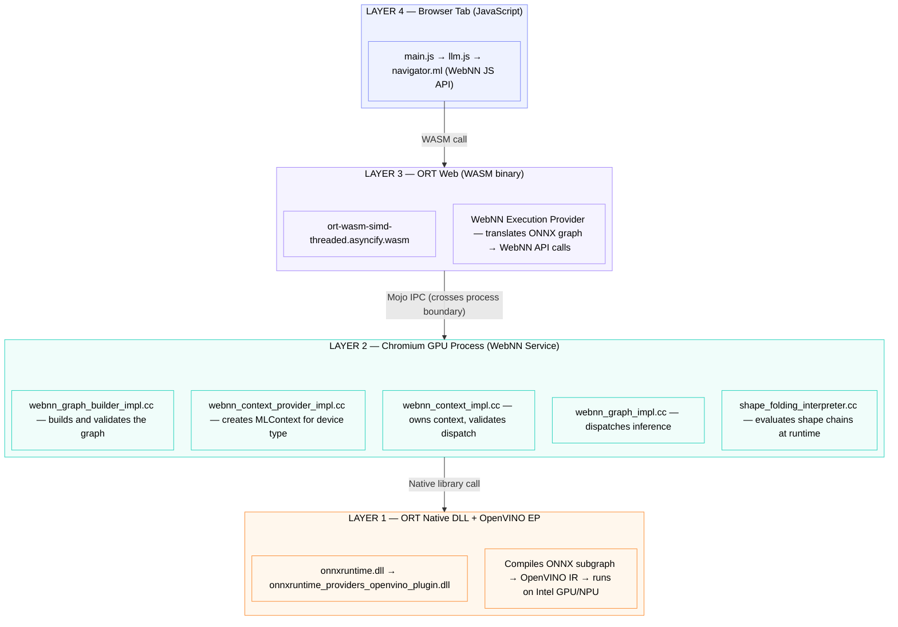

# WebNN Text-Generation Architecture & Execution Flow

**Based on unmodified source:**
- Demo: `Honry/webnn-developer-preview` @ `support_qwen3`
- ORT WebNN EP: `Honry/onnxruntime` @ `dynamic-dim-poc`
- Chromium WebNN Service: `miaobin/chromium` @ `webnn-fully-dynamic-rebase`

**Last updated:** June 5, 2026

---

## 1. System Overview

Running an LLM in the browser via WebNN involves four distinct layers, each with a specific responsibility:



Each layer only talks to the one directly below it. The browser tab never touches the GPU directly — everything goes through this chain.

---

## 2. Model Types

Two types of ONNX models are supported, differing significantly in structure.

### GQA Models (ORT-GenAI builder export)

These use a single fused `GroupQueryAttention` op that encapsulates all of: rotary embeddings, KV cache update, head broadcasting, causal masking, and scaled dot-product attention.

```
Inputs:
  input_ids                     int64   [1, sequence_length]
  attention_mask                int64   [1, total_sequence_length]
  past_key_values.{L}.key       float16 [1, kv_heads, past_seq_len, head_size]
  past_key_values.{L}.value     float16 [1, kv_heads, past_seq_len, head_size]

Outputs:
  logits                        float16 [1, 1, vocab_size]
  present.{L}.key               float16 [1, kv_heads, past_seq_len, head_size]
  present.{L}.value             float16 [1, kv_heads, past_seq_len, head_size]

Core ops per layer: SimplifiedLayerNormalization → MatMulNBits → GroupQueryAttention
Total nodes: ~300
```

Note: `present` shape equals `past` shape — the GQA op writes new tokens in-place using `ScatterND` at the correct offset. The buffer size never changes.

### Stateful GQA Models (`enableCausalLM: true`)

Same model structure but a different KV update strategy selected at session creation. Instead of ScatterND (stateless), the GQA op uses a `concat`-based approach where the framework manages KV state growth internally. KV dims are `[1, kv_heads, 1, head_size]` at session creation — tiny seed tensors — and the model grows them internally. Also passed as an OpenVINO EP hint for NPU optimization.

---

## 3. How Models Are Generated

Models for this flow are built using the **ORT-GenAI model builder** (`builder.py`), which takes a HuggingFace model and exports it as an optimized ONNX file ready for WebNN inference.

### Example Command

```bash
python builder.py \
  -m  Qwen/Qwen2-0.5B-Instruct \
  -o  webnn-qwen2-0.5B \
  -c  honry-cache-dir \
  -p  int4 \
  -e  webgpu \
  --extra_options \
    shared_embeddings=true \
    int4_algo_config=rtn_last \
    int4_is_symmetric=true \
    enable_webgpu_graph=true \
    prune_lm_head=true \
    hf_remote=false
```

### Flag Reference

| Flag | Value | Meaning |
|------|-------|---------|
| `-m` | `Qwen/Qwen2-0.5B-Instruct` | HuggingFace model ID to export |
| `-o` | `webnn-qwen2-0.5B` | Output directory for the generated model files |
| `-c` | `honry-cache-dir` | Local cache directory for HuggingFace weights (avoids re-downloading) |
| `-p` | `int4` | Quantization precision — INT4 weights reduce model size ~4× vs FP16 |
| `-e` | `webgpu` | Target execution provider — `webgpu` produces the fused GQA-capable export |

### `--extra_options` Explained

| Option | Value | Meaning |
|--------|-------|---------|
| `shared_embeddings` | `true` | Shares input embedding weights with the output projection (lm_head), reducing model size when they are tied in the original architecture |
| `int4_algo_config` | `rtn_last` | INT4 quantization algorithm — Round-to-Nearest applied to the last (output) dimension of weight matrices; good balance of speed and accuracy |
| `int4_is_symmetric` | `true` | Symmetric INT4 quantization (zero point = 0); simpler dequantization, slightly lower accuracy than asymmetric but faster |
| `enable_webgpu_graph` | `true` | Enables the fused `GroupQueryAttention` op and other WebGPU/WebNN-optimized graph patterns; without this the model exports as standard decomposed attention |
| `prune_lm_head` | `true` | Removes unused output rows from the language model head (vocabulary entries that are never the top-k prediction), reducing logits tensor size |
| `hf_remote` | `false` | Use local cache only — no network calls to HuggingFace during export (required on networks with proxy restrictions) |

### What the Builder Produces

```
webnn-qwen2-0.5B/
├── model.onnx              ← ONNX graph with GroupQueryAttention fused ops
├── model.onnx.data         ← External weight data (large binary, referenced by model.onnx)
├── genai_config.json       ← Model metadata: layer count, KV head count, head size, vocab size,
│                              search params (temperature, top_k, top_p), EOS token IDs
├── tokenizer.json          ← HuggingFace tokenizer (BPE vocab + merge rules)
├── tokenizer_config.json   ← Chat template, special token IDs
└── special_tokens_map.json ← EOS, BOS, PAD token mappings
```

### Why `webgpu` EP Produces GQA Models

The `-e webgpu` flag instructs the builder to apply WebGPU/WebNN-specific graph optimizations, the most important of which is fusing the multi-head attention + KV cache manipulation into a single `GroupQueryAttention` op. This fusion:

- Reduces graph nodes from ~5000+ (raw HuggingFace Optimum export) to ~300
- Eliminates `Where`, `Equal`, `Range`, `ConstantOfShape` shape-computation subgraphs
- Replaces dynamic KV concat with static-size ScatterND update (fixed buffer, write at offset)
- Enables a single WebNN partition — the entire model runs on GPU with no CPU fallback nodes

Without `enable_webgpu_graph=true`, the export uses decomposed attention (~5000 nodes) which is harder to compile as a single WebNN partition.

### Key Model Config Values (from `genai_config.json`)

The values in `genai_config.json` directly map to the `MODELS` config object in `main.js`:

```json
{
    "model": {
        "decoder": {
            "head_size": 64,           → model.head_size
            "num_hidden_layers": 24,   → model.num_layers
            "num_key_value_heads": 2,  → model.kv_num_heads
        },
        "vocab_size": 151936,          → model.vocab_size
        "eos_token_id": [151645, 151643]  → model.eos_token_id
    },
    "search": {
        "temperature": 0.7,            → model.temperature
        "top_k": 20,                   → model.top_k
        "top_p": 0.8                   → model.top_p
    }
}
```

---

## 4. Session Creation — The Dimension Strategy

This happens once when the model loads and controls the entire shape of the computation graph.

### Code Path (`llm.js load()`)

```
main.js: user clicks "Load Model"
    ↓
llm.js: load(model, options)
    1. navigator.ml.createContext({ deviceType: "gpu" })  → mlContext
    2. Build sessionOptions with EP config
    3. ort.InferenceSession.create(modelBytes, sessionOptions)
    4. ORT compiles ONNX → WebNN graph (happens once, takes 2–10s)
```

### Session Options — Two Dimension Mechanisms

**`freeDimensionBounds`** — tells ORT "this dimension can vary, but here is the maximum":

```js
freeDimensionBounds: {
    sequence_length:       { maxSize: maxLength },   // input token count
    total_sequence_length: { maxSize: maxLength },   // attention_mask length
}
```

Used for GQA. The WebNN graph is compiled with dynamic shapes but bounded. At dispatch time, any shape ≤ max is valid.

**`freeDimensionOverrides`** — tells ORT "this dimension is exactly this value, always":

```js
// Stateless GQA:
freeDimensionOverrides: {
    batch_size: 1,
    past_sequence_length: maxLength,   // KV cache shape is always [1, H, maxLength, D]
}

// Stateful GQA (enableCausalLM: true):
freeDimensionOverrides: {
    batch_size: 1,
    // no past_sequence_length — model manages KV size internally
}
```

This makes dimensions fully static at compile time. Static dims enable constant folding — any subgraph that computes shapes becomes trivially foldable because all inputs are concrete numbers.

**`enableCausalLM`** — selects KV update strategy inside `gqa_op_builder.cc`:

```js
// session-options.ts (ORT Web):
const enableCausalLM = webnnOptions?.enableCausalLM;
if (enableCausalLM) {
    appendEpOption(epOptions, 'enableCausalLM', 'true', allocs);
}
```

When `true`: concat-based stateful KV. When `false` (default): ScatterND stateless KV.

---

## 5. ORT WebNN EP — Translating ONNX to WebNN Ops

### What Happens Inside `ort.InferenceSession.create()`

ORT's WebNN EP processes the ONNX graph node by node via `model_builder.cc`, translating each op into WebNN API calls.

**Shape resolution during graph build:**
1. ORT's standard constant folding runs first. With `freeDimensionOverrides` making all dims concrete, shape subgraphs (`Where`, `Equal`, `Range`, `ConstantOfShape` chains) evaluate to constants and disappear.
2. For GQA models with `freeDimensionBounds`, dims are dynamic but bounded — ORT's graph builder tracks symbolic dim names.

### GroupQueryAttention Decomposition (`gqa_op_builder.cc`)

The single `GroupQueryAttention` ONNX op is decomposed into a subgraph of WebNN primitives:

```
Input: Q [B, S, num_heads×head_size]
       K [B, S, kv_heads×head_size]
       V [B, S, kv_heads×head_size]
       past_key   [B, kv_heads, past_seq, head_size]
       past_value [B, kv_heads, past_seq, head_size]
       attention_mask [B, total_seq]

Step 1 — Compute position:
    seqlens_k = reduceSum(attention_mask) - 1
    offset = seqlens_k - (S - 1)

Step 2 — RoPE (if model uses rotary embeddings):
    cos/sin sliced from cache at computed position
    Q_rot = Q_even × cos − Q_odd × sin
    K_rot = same pattern

Step 3 — KV Cache Update:
    STATELESS (ScatterND):
        scatter_indices = expand([batch, head, seq_pos])
        present_key   = scatterND(past_key, indices, new_K)
        present_value = scatterND(past_value, indices, new_V)

    STATEFUL (concat, enableCausalLM=true):
        present_key   = concat([past_key, new_K], axis=seq)
        present_value = concat([past_value, new_V], axis=seq)

Step 4 — GQA Head Broadcast (kv_heads → num_heads):
    K: [B, kv_N, P, H] → expand → [B, kv_N, G, P, H] → reshape → [B, N, P, H]
    V: same

Step 5 — Causal Attention Mask:
    row_idx = cumulativeSum(ones, exclusive) + offset
    col_idx = cumulativeSum(ones, exclusive, axis=seq)
    mask = where(row_idx >= col_idx, 0.0, -inf)

Step 6 — Scaled Dot-Product Attention:
    scores = matmul(Q, K^T) × (1/√head_size)
    scores = scores + causal_mask
    weights = softmax(scores, axis=-1)
    output = matmul(weights, V)
```

### WebNN Ops Used by GQA

| Category | Ops |
|----------|-----|
| Tensor manipulation | `reshape`, `transpose`, `expand`, `concat`, `split`, `gather`, `cast` |
| Arithmetic | `add`, `sub`, `mul` |
| Reduction | `reduceSum`, `cumulativeSum` |
| Scatter | `scatterND` |
| Comparison / Logic | `lesser`, `where`, `logicalAnd` |
| Attention | `scaledDotProductAttention` (or `matmul` + `softmax` fallback) |

### QDQ Fix (`qdq_op_builder.cc`)

For quantized models, `DequantizeLinear` with per-axis scale (1D scale, 2D+ input) requires the scale to be reshaped to be broadcastable. The fix removes the `axis != last` guard and reshapes scale/zero_point for all axes. This is why `ort.webgpu.min.js` must be used — the `ort.all.min.js` JS bundle has its own DQLinear validation that rejects this before it reaches WASM.

---

## 6. Chromium WebNN Service — Graph Build & Dispatch

### Graph Build (`webnn_graph_builder_impl.cc`)

When ORT Web calls the WebNN API to build the graph, it crosses the Mojo IPC boundary into the Chromium GPU process. Every op and operand is validated, then the compiled graph is handed to the native ORT DLL + OpenVINO EP.

Key validations:
- Every operand shape is checked (static dims must match exactly, dynamic dims checked against bounds)
- Every op's input/output types validated against hardware support
- `ShapeFoldingInterpreter` available for any `dynamicReshape` or `dynamicExpand` ops not resolved by ORT

### Shape Folding Interpreter (`shape_folding_interpreter.cc`)

A dispatch-time interpreter that evaluates integer tensor values by tracing backward through the computation graph. Used when `dynamicReshape` or `dynamicExpand` ops have shape inputs that were not constant-folded by ORT.

**Supported operations it can evaluate:**

| Operation | What it does |
|-----------|-------------|
| `shape()` | Returns input tensor dimensions as int64 values |
| `concat` | Concatenates evaluated inputs |
| `gather` | Indexes into evaluated data using evaluated indices |
| `slice`, `dynamic_slice` | Extracts a sub-range |
| `reshape`, `transpose`, `reverse` | Passthrough / reorder |
| `add`, `sub`, `mul`, `div`, `min`, `max`, `mod` | Integer arithmetic with broadcasting |
| `cast` | Type-level — values pass through |
| `floor`, `ceil`, `abs`, `neg` | Element-wise on integers |
| `range` | Generates integer sequence |
| `where` | Conditional element-wise selection |
| `reduce` | Sum, product, max, min on 1D tensors |

> **Note:** For all currently tested models, ORT's standard constant folding (triggered by `freeDimensionOverrides`) resolves everything before this interpreter runs. The SFI is defense-in-depth for future models or non-ORT WebNN clients.

### Dispatch Validation (`webnn_context_impl.cc`)

Each `session.run()` call from JS dispatches the compiled graph. Before running, the context validates:
1. Input tensor names and shapes match what the graph expects
2. For dynamic dims: actual shape is within `[min_size, max_size]` bounds
3. All tensors with the same symbolic dim name have consistent concrete values across all inputs
4. No tensor appears in both inputs and outputs

---

## 7. Memory Allocation — MLTensors

JavaScript pre-allocates GPU memory buffers (MLTensors) before inference begins, eliminating allocation overhead during the generate loop.

### `createMlTensor()` (`common_utils.js`)

```js
export async function createMlTensor(mlContext, dataType, dims, writable, readable) {
    const mlTensor = await mlContext.createTensor({
        dataType: dataType === "bool" ? "uint8" : dataType,
        shape: dims,
        writable,   // JS can write into this tensor
        readable,   // JS can read from this tensor
    });
    return ort.Tensor.fromMLTensor(mlTensor, { dataType, dims });
}
```

The `writable`/`readable` flags control performance:

| Tensor | writable | readable | Reason |
|--------|----------|----------|--------|
| Past KV inputs | false | false | GPU writes only, never read by JS |
| Present KV outputs | false | false | GPU-to-GPU only, zero-copy swap |
| Logits output | false | true | Must be read back to CPU for token selection |

### Pre-allocation in `initialize()` (`llm.js`)

```
For each of numLayers layers:
    feed["past_key_values.{i}.key"]   = MLTensor [1, kv_heads, maxLength, head_size]
    feed["past_key_values.{i}.value"] = MLTensor [1, kv_heads, maxLength, head_size]

    // Stateless only (enableCausalLM=false):
    fetches["present.{i}.key"]        = MLTensor [1, kv_heads, maxLength, head_size]
    fetches["present.{i}.value"]      = MLTensor [1, kv_heads, maxLength, head_size]

fetches["logits"] = MLTensor [1, 1, vocab_size]   (readable=true)
```

For stateful (`enableCausalLM=true`): no present KV tensors pre-allocated — model manages state internally.

---

## 8. Prefill — Processing the Prompt

`generate()` is called with the tokenized prompt as `inputIds`.

```
input_ids      = [t₁, t₂, ..., tₙ]   shape: [1, N]
attention_mask = [1, 1, ..., 1]       shape: [1, N]      (all ones)
past_kv.*.key  = pre-allocated zeros  shape: [1, H, maxLen, D]
                           ↓
              session1.run(feed, fetches)       ← one GPU dispatch
                           ↓
logits         = float16 [1, 1, vocab_size]    ← in pre-allocated MLTensor (GPU)
present.*.key  = float16 [1, H, maxLen, D]     ← KV cache with positions 0..N-1 filled
```

After the dispatch:
1. **Read logits to CPU**: `mlContext.readTensor(logits_mlTensor, logitsBuffer)` — only ~vocab_size × 2 bytes cross GPU→CPU
2. **Apply repetition penalty** (if configured)
3. **Select first output token** — argmax or sampling
4. **KV cache swap** — `updateKvCache(outputs)`:
   ```js
   for each "present.*" in outputs:
       temp = feed["past_key_values.*"]
       feed["past_key_values.*"] = fetches["present.*"]   // last output → next input
       fetches["present.*"]      = temp                   // old input → next output buffer
   ```
   Zero-copy — no GPU memory moves, only JS object references are swapped.
5. `startLength += N`

---

## 9. Decode Loop — Token-by-Token Generation

```
WHILE lastToken not in eos_token_ids AND startLength < maxLength:

    feed["input_ids"]      = [lastToken]           shape: [1, 1]
    feed["attention_mask"] = [1, 1, ..., 1]        shape: [1, startLength+1]  ← grows by 1
    (optional) feed["position_ids"] = [startLength] shape: [1, 1]

    session1.run(feed, fetches)     ← GPU dispatch

    Inside GQA on GPU:
        seqlens_k = sum(attention_mask) - 1   → current position
        offset    = seqlens_k - (S-1)         → where to write in KV cache
        scatterND(past_key, offset, new_K)    → writes at correct position
        Causal mask built from seqlens_k
        SDPA: softmax(QK^T/√d + mask) × V
        → logits [1,1,vocab], present_kv [1,H,maxLen,D]

    readTensor(logits_mlTensor) → logitsBuffer     ← only logits cross GPU→CPU
    applyRepetitionPenalty(logitsBuffer)
    lastToken = selectToken(logitsBuffer)           ← argmax or sampling
    outputTokens.push(lastToken)
    callback(outputTokens)                          ← streams text to UI

    updateKvCache(outputs)                          ← swap MLTensor references (zero-copy)
    startLength++
```

### What Never Leaves the GPU

- All KV cache data (`past_key_values.*`, `present.*`) — stays in MLTensors on GPU
- All intermediate computations: RoPE, attention scores, softmax, head broadcast
- Only **logits** (~vocab_size × 2 bytes, typically ~300KB) cross GPU→CPU per token

---

## 10. Attention Mask — Grows Each Step

```
Prefill (N=24 tokens):   [1, 1, 1, ..., 1]               shape: [1, 24]
Decode step 1:           [1, 1, 1, ..., 1, 1]             shape: [1, 25]
Decode step 2:           [1, 1, 1, ..., 1, 1, 1]          shape: [1, 26]
...
```

Inside the GQA op: `seqlens_k = reduceSum(mask) - 1` gives the current sequence position, which determines where `scatterND` writes the new KV entry. This dynamic shape is why `freeDimensionBounds` is needed — the mask grows up to `maxLength` but its exact size changes every step.

---

## 11. Token Selection

After each inference step, `selectToken()` picks the next token in JavaScript:

**Greedy (temperature = 0):** `argmax(logitsBuffer, vocabSize)` — picks the highest probability token.

**Sampling (temperature > 0):** `sampleTopK()`:
1. Sort all vocab tokens by logit score descending
2. Keep top-K tokens (if `topK > 0`)
3. Apply temperature: divide logits by temperature (higher = more random)
4. Compute softmax probabilities
5. Apply nucleus (top-p) filtering: keep smallest token set whose cumulative probability ≥ topP, renormalize
6. Sample randomly from the remaining distribution

**Thinking budget:** If `endThinkTokenId` and `maxThinkTokens` are set (e.g. DeepSeek R1), the loop forces `</think>` by overriding `lastToken` if the budget is exceeded before the model emits it.

**Repetition penalty:** Before each token selection, tokens in `outputTokens` have scores reduced: `score /= penalty^min(count, 3)`. Capped at count=3 to avoid destroying common word probabilities.

---

## 12. Multi-Turn Chat

KV cache is reused across turns in the same conversation. In `Query()` (`main.js`):

```
If continuation AND llm.startLength + deltaTokens ≤ maxLength:
    inputIds = inputIds.slice(llm.startLength)   ← feed only NEW tokens
    // KV cache already contains previous context

Else (new conversation or context overflow):
    llm.initialize()                              ← reset KV cache to zeros
    llm.startLength = 0
    inputIds = full prompt including history
```

When continuing, the model only processes new tokens but its KV cache retains all previous context — no re-running prefill on the full chat history.

---

## 13. KV Cache Memory Layout

```
MLTensor: past_key_values.0.key
Shape: [1, kv_num_heads, maxLength, head_size]   Type: float16

┌────────┬────────┬────────┬─────┬────────┬────────────────┐
│ pos 0  │ pos 1  │ pos 2  │ ... │ pos N  │   (unused)     │
│ ██████ │ ██████ │ ██████ │     │ ██████ │  ░░░░░░░░░░░░  │
└────────┴────────┴────────┴─────┴────────┴────────────────┘
◀─── filled by ScatterND ────────▶◀── zeros (never read) ──▶

After ScatterND writes new token at position N+1:
┌────────┬────────┬────────┬─────┬────────┬──────┬─────────┐
│ pos 0  │ pos 1  │ pos 2  │ ... │ pos N  │pos N+1│(unused)│
│ ██████ │ ██████ │ ██████ │     │ ██████ │██████ │░░░░░░░░│
└────────┴────────┴────────┴─────┴────────┴───────┴────────┘
```

**Double-buffer zero-copy swap:**
```
Step T:   feed[past_kv.0.key] = tensor_A    fetches[present.0.key] = tensor_B
          GQA reads from A, ScatterND writes to B

Step T+1: feed[past_kv.0.key] = tensor_B    fetches[present.0.key] = tensor_A
          GQA reads from B, ScatterND writes to A
```

No GPU→CPU→GPU data copy. Only logits read back to CPU for token selection.

---

## 14. Performance Profile

| Phase | Typical Time | GPU↔CPU Data | Notes |
|-------|-------------|--------------|-------|
| Session create | 2–10s | ~model size (once) | ONNX → OpenVINO IR compilation |
| KV init (`initialize`) | ~50ms | 0 | MLTensor allocation only |
| Prefill (N tokens) | 140ms–2.3s | ~300KB (logits only) | Single GPU dispatch, all tokens at once |
| Each decode step | 6–40ms | ~300KB (logits only) | 1 GPU dispatch + JS reference swap |
| KV data per step | 0 | **0 bytes** | Zero-copy — JS reference swap only |

### Measured (Qwen2 0.5B, GPU)

| Metric | Value |
|--------|-------|
| Time to first token | ~0.14s |
| Decode throughput | ~32 tok/s |

### Measured (Llama 3.2 3B, GPU)

| Metric | Value |
|--------|-------|
| Time to first token | ~0.33s |
| Decode throughput | ~12 tok/s |

---

## 15. File Map

| What | File | Layer |
|------|------|-------|
| UI, model configs, chat loop | `demos/text-generation/main.js` | Browser JS |
| Inference pipeline, KV management | `demos/text-generation/llm.js` | Browser JS |
| MLTensor helpers, ORT setup | `assets/js/common_utils.js` | Browser JS |
| WebNN EP options parsing | `js/web/lib/wasm/session-options.ts` | ORT Web |
| WebNN EP: graph compilation | `webnn_execution_provider.cc` | ORT WASM |
| WebNN EP: ONNX→WebNN translation | `builders/model_builder.cc` | ORT WASM |
| GroupQueryAttention decomposition | `builders/impl/gqa_op_builder.cc` | ORT WASM |
| QDQ per-axis fix | `builders/impl/qdq_op_builder.cc` | ORT WASM |
| WebNN graph build + validation | `webnn_graph_builder_impl.cc` | Chromium |
| WebNN graph dispatch | `webnn_graph_impl.cc` | Chromium |
| Runtime shape evaluation | `public/cpp/shape_folding_interpreter.cc` | Chromium |
| Dispatch validation | `webnn_context_impl.cc` | Chromium |
